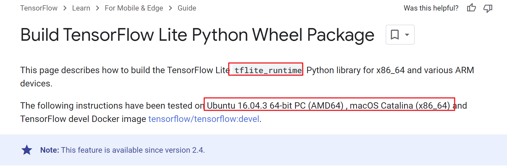

# tflite-runtime-whl-windows
# 目标

用于保存windows下编译好的tflite-runtime-whl文件, 方便大家取用

# 背景

需要用到keras训练的模型，但完整的tf包，在windows下大约有1G，使用pyinstaller打包后，生成的exe大概450mb，太大，查官方资料发现有tfruntime，据说用于嵌入式，想来体积较小。但win环境下没有编译好的whl包,如下图所示：

来源：https://www.tensorflow.org/lite/guide/build_cmake_pip

# 详细的编译方法

请见：https://www.cnblogs.com/FairlyHarmony/p/18122952
